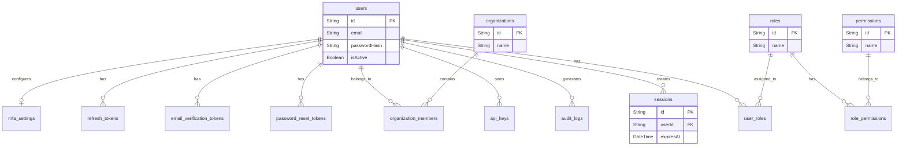

# Entity Relationship Diagram

```mermaid
erDiagram
    users ||--o{ user_roles : has
    users ||--o{ organization_members : belongs_to
    users ||--o{ sessions : creates
    users ||--o{ audit_logs : generates
    users ||--o{ api_keys : owns
    users ||--o{ password_reset_tokens : has
    users ||--o{ email_verification_tokens : has
    users ||--o{ refresh_tokens : has
    users ||--o| mfa_settings : configures

    roles ||--o{ user_roles : assigned_to
    roles ||--o{ role_permissions : has

    permissions ||--o{ role_permissions : belongs_to

    organizations ||--o{ organization_members : contains

    users {
        String id PK
        String email
        String passwordHash
        Boolean isActive
    }

    roles {
        String id PK
        String name
    }

    permissions {
        String id PK
        String name
    }

    organizations {
        String id PK
        String name
    }

    sessions {
        String id PK
        String userId FK
        DateTime expiresAt
    }
```
